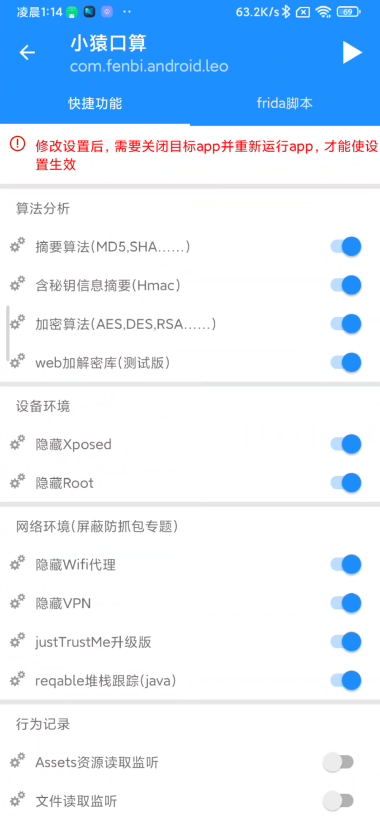
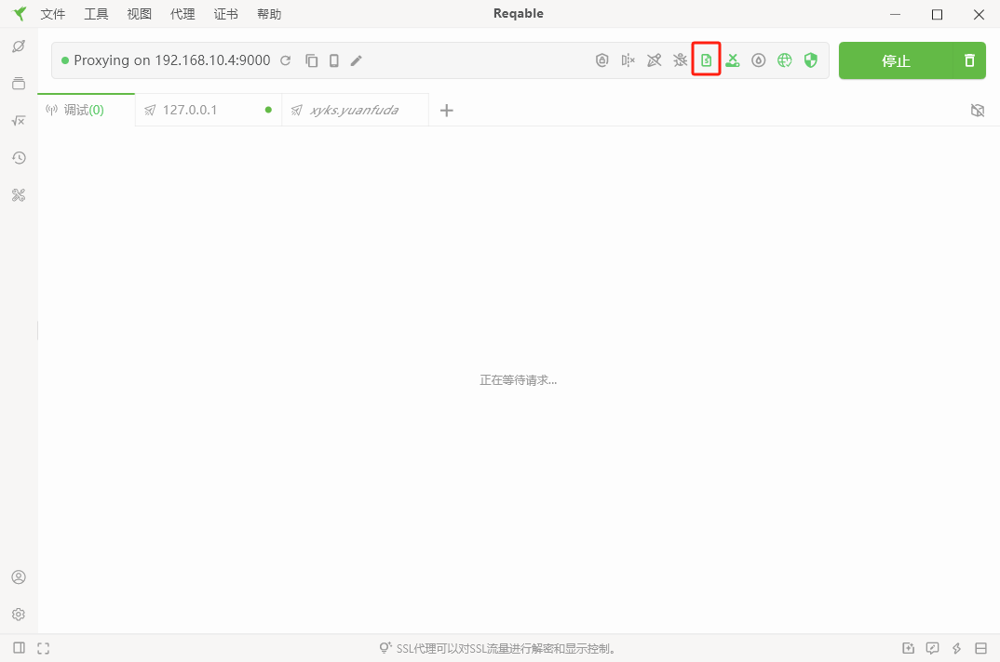
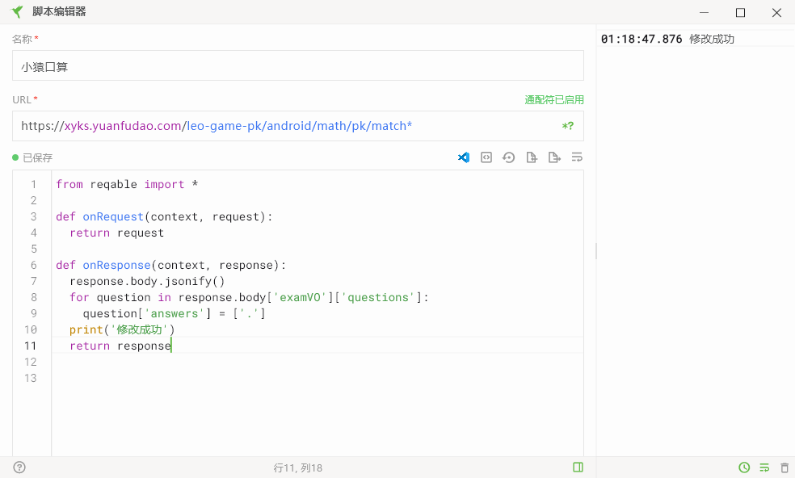

# 小猿口算全自动挂机刷分，极简方式

## 原理：修改响应内容，使用连点器持续运行

## 效果：

- 视频

 https://github.com/user-attachments/assets/dc6f09ee-cc40-41d8-a15b-08e99544a3c5

- 速度：

  

  

## 环境： 安卓为例

### 1. root手机

### 2. 安装Magisk+Lsposed模块
   
### 3. 安装算法助手Pro
   Lsposed中算法助手勾选小猿口算

   

 算法助手小猿口算开启如下设置

   

### 4. 下载[Reqable]("https://reqable.com/zh-CN/")抓包工具，pc版本
### 5. 安装证书,以Magisk模块方式
   
### 6. 开启脚本
   
### 7. 新建脚本


匹配规则

```apl
https://xyks.yuanfudao.com/leo-game-pk/android/math/pk/match*
```

修改代码

 ```python
from reqable import *

def onRequest(context, request):
  return request

def onResponse(context, response):
  response.body.jsonify()
  for question in response.body['examVO']['questions']:
    question['answers'] = ['.']
  print('修改成功')  
  return response
 ```
### 8.修改手机wifi代理为第6步中ip和端口
### 9.进行pk，进入游戏点击屏幕即可

### 10. 借助连点器可以自动化连续操作