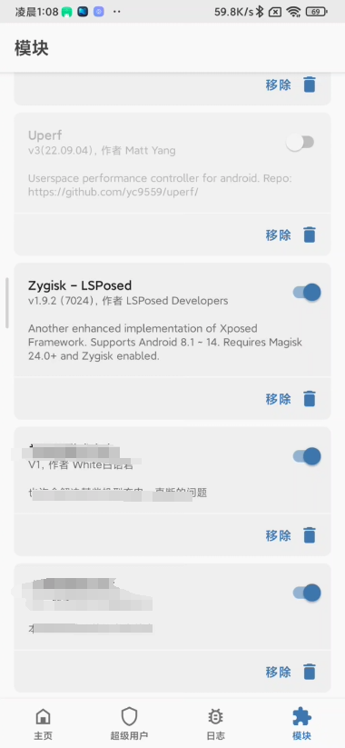
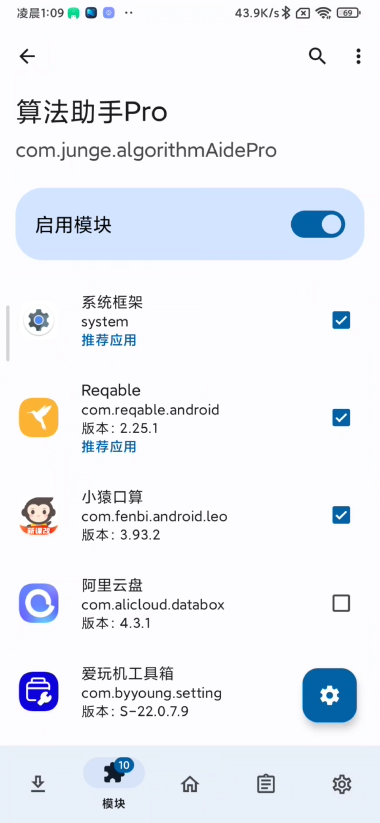
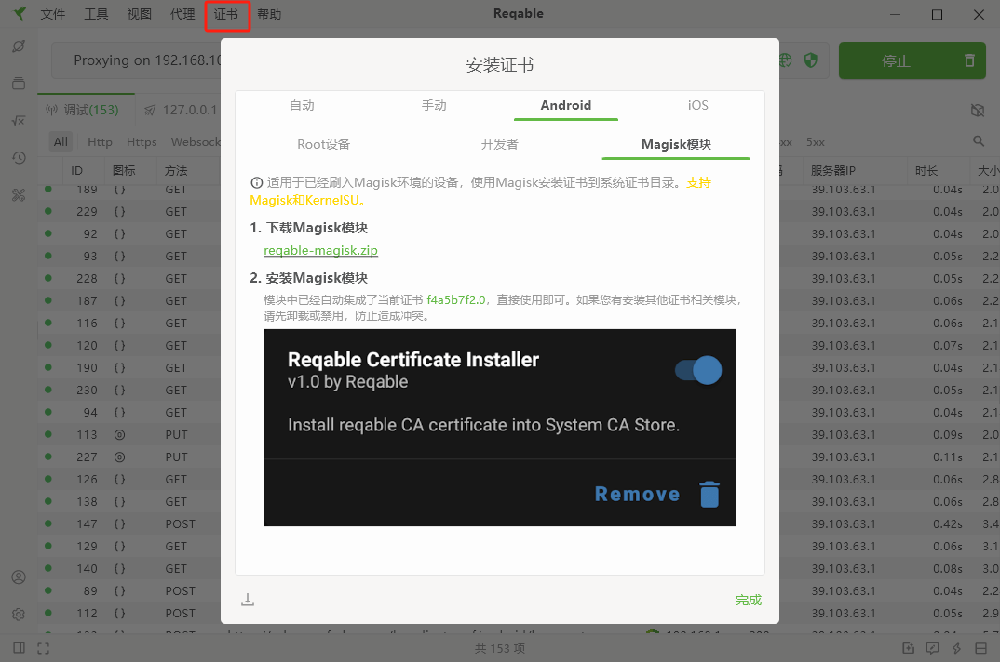

# 小猿口算全自动挂机刷分，极简方式

## 原理：修改响应内容，使用连点器持续运行

## 新版加密分析（未完成）
app中pk响应二进制第一段与抓包脚本中匹配一致

- app端加密响应


- 抓包脚本加密响应


- 对比

```
y7KptyngpGugGoc+lK6O8IIJOXeQMNxSyvDKCh8vrXeYGxDQ2In+LPSg8L73krWxWk1vYZ7kwMFDyiK1L4aoE+E9QYGw5UlZXogqQ67ovhR2zAGeaJEfUtAGm/GNYZOqMsqgsJ6NfNJt7w+yLyJC7tqaGkrVyJKf5UJtpRC15dr/H/Mmo/HOUc83LnPxN8IVxpL59NKXDen7y8uA/9nCOX6fhizcajpVJiB6szvT9Z9zGoq1zjcjvlLBHzCvriNfdmPaamLJp4VcFnc7BR57mZ9u11lc0FPpobYBstNBqxg+ROzwIJdfmnoR6e0/w9PRHNZvroM73vEJwIYE3gdgsXSb8imIGoR84nW4RElGGdGde+YiyurEW6BhRI94zF9UBpotwNyfy28z40Ii+TsM7VHcqQVaINR2Hv89BwKG76BvH8ssS81sQNp0XzNzx2z728HCBifHc8Worc2jB724LqXR8KpLtm/aUnQnZyYkkah2pwV6pE2y//ypuLdECtBtt6Zg/FPEjBud9pCTVtiK9FttPdKeUZq/2oPMZ70uPqJc3U8DDubQenkeK48VH6pI7Zv/UkBaRLgYAKMFwEtneOWkLgDaiNNdmaPuRXVq+YnjiWDOfIZM0Xta3PYSGxvV0637nYULmeSuxfc0LlhadwKUiywdZRpTXUZ7q5S8ianGLJ5QvaKVy98G2wh0BDSKMVcwjPt9fAyTSwm+MrURlCsfgJNL2MfWRoQcO91lR76A8iZjVRpdSvwOjniYptffE1higMGASCV392WVQVfuiG6DRQ96wxIuB+4FPw87xizGpWC3UwMZEBrvhDvSiMhcnVrfc44Ngjn07xWkflzliC5j2aladZl2d2WjSFZjjZtH3QnEmg==
```
```
y7KptyngpGugGoc+lK6O8IIJOXeQMNxSyvDKCh8vrXeYGxDQ2In+LPSg8L73krWxWk1vYZ7kwMFDyiK1L4aoE+E9QYGw5UlZXogqQ67ovhR2zAGeaJEfUtAGm/GNYZOqMsqgsJ6NfNJt7w+yLyJC7tqaGkrVyJKf5UJtpRC15dr/H/Mmo/HOUc83LnPxN8IVxpL59NKXDen7y8uA/9nCOX6fhizcajpVJiB6szvT9Z9zGoq1zjcjvlLBHzCvriNfdmPaamLJp4VcFnc7BR57mZ9u11lc0FPpobYBstNBqxg+ROzwIJdfmnoR6e0/w9PRHNZvroM73vEJwIYE3gdgsXSb8imIGoR84nW4RElGGdGde+YiyurEW6BhRI94zF9UBpotwNyfy28z40Ii+TsM7VHcqQVaINR2Hv89BwKG76BvH8ssS81sQNp0XzNzx2z728HCBifHc8Worc2jB724LqXR8KpLtm/aUnQnZyYkkah2pwV6pE2y//ypuLdECtBtt6Zg/FPEjBud9pCTVtiK9FttPdKeUZq/2oPMZ70uPqJc3U8DDubQenkeK48VH6pI7Zv/UkBaRLgYAKMFwEtneOWkLgDaiNNdmaPuRXVq+YnjiWDOfIZM0Xta3PYSGxvV0637nYULmeSuxfc0LlhadwKUiywdZRpTXUZ7q5S8ianGLJ5QvaKVy98G2wh0BDSKMVcwjPt9fAyTSwm+MrURlCsfgJNL2MfWRoQcO91lR76A8iZjVRpdSvwOjniYptffE1higMGASCV392WVQVfuiG6DRQ96wxIuB+4FPw87xizGpWC3UwMZEBrvhDvSiMhcnVrfc44Ngjn07xWkflzliC5j2aladZl2d2WjSFZjjZtH3QnEmg==
```

app端二次加密


在线解密数据


**最后二次加密较为复杂且被加密**


## 效果：

- 视频

 https://github.com/user-attachments/assets/dc6f09ee-cc40-41d8-a15b-08e99544a3c5

- 速度：

  

  

## 环境： 安卓为例

### 1. root手机

### 2. 安装Magisk+Lsposed模块
   
### 3. 安装算法助手Pro
   Lsposed中算法助手勾选小猿口算

   

 算法助手小猿口算开启如下设置

   

### 4. 下载[Reqable]("https://reqable.com/zh-CN/")抓包工具，pc版本
### 5. 安装证书,以Magisk模块方式
   
### 6. 开启脚本
   
### 7. 新建脚本


匹配规则

```apl
https://xyks.yuanfudao.com/leo-game-pk/android/math/pk/match*
```

修改代码

 ```python
from reqable import *

def onRequest(context, request):
  return request

def onResponse(context, response):
  response.body.jsonify()
  for question in response.body['examVO']['questions']:
    question['answers'] = ['.']
  print('修改成功')  
  return response
 ```
### 8.修改手机wifi代理为第6步中ip和端口
### 9.进行pk，进入游戏点击屏幕即可

### 10. 借助连点器可以自动化连续操作